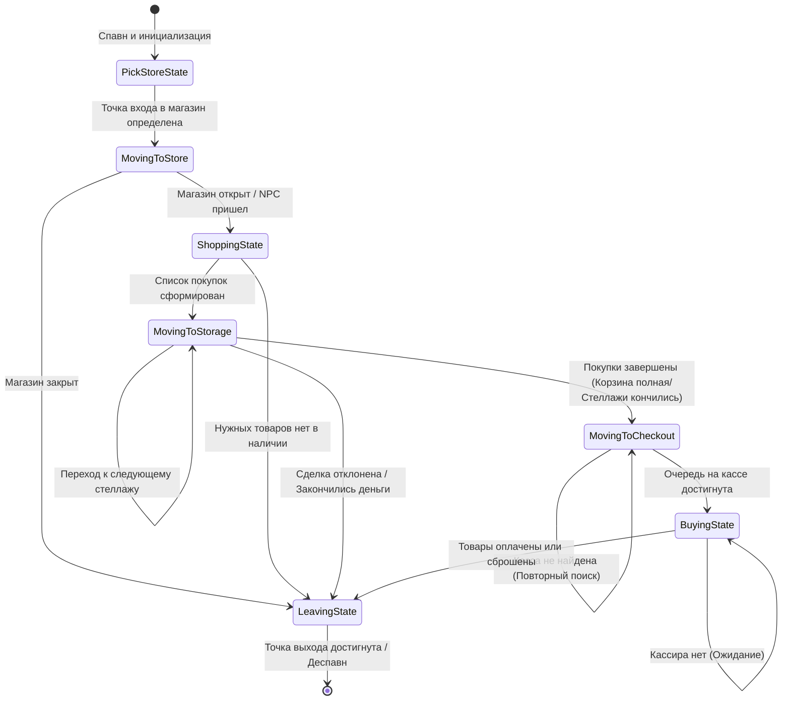
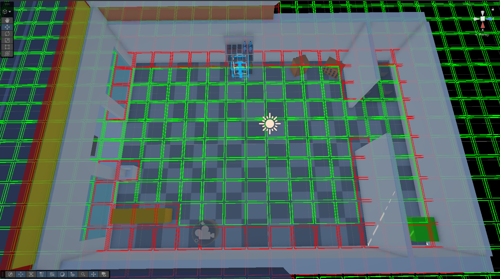

## Иерархическая конечно-автоматная система (FSM AI)

В проекте реализована классическая архитектура **Finite State Machine (State Pattern)** для управления поведением покупателей (NPC) в симуляторе магазина. Система полностью развязана (decoupled): контроллер `NPCController` выступает в роли контекста, а логика состояний инкапсулирована в отдельных классах, наследующих интерфейс `INPCState`.

Демонстрация системы FSM - https://youtu.be/uycTad_G77U

Реакция NPC на цену (нормальная цена) - https://youtu.be/5ayztOv7tMc 

Реакция NPC на цену (высокая цена) - https://youtu.be/1ESaVMZOwh0

### Граф состояний ИИ (State Transition Diagram)

## Система строительства

### Обзор

Система размещения объектов на основе сетки, покрывающей весь пол магазина. Игрок может подбирать, вращать и устанавливать объекты — **Buildable** — на сетку в реальном времени. Перед подтверждением размещения выполняется валидация: призрак-превью становится **зелёным**, если целевые ячейки свободны, и **красным**, если заняты или выходят за границы. Каждый размещённый объект отслеживается по ячейкам, что позволяет системе мгновенно уведомлять систему навигации о любом изменении планировки магазина.

Демонстрация работы системы строительства - https://youtu.be/QHrJtVH4uBQ

---

### Компоненты

| Класс | Ответственность |
|---|---|
| `BuildingGrid` | Владеет `Dictionary<Vector2Int, BuildingGridCell>`, покрывающим пол магазина. Инициализирует сетку в `Awake` и перерегистрирует все заранее расставленные объекты в `Start`. |
| `BuildingGridCell` | Класс данных. Хранит `gridPosition`, `worldPosition`, флаг `IsOccupied` и ссылку на занимающий ячейку `IBuildable`. |
| `IBuildable` | Интерфейс, который обязан реализовать каждый размещаемый объект. Предоставляет `Size`, `GhostPrefab`, `BuildPosition`, `BuildRotationY`, `WallOffset`, `YOffset`, `OnPlaced()` и `OnRemoved()`. |
| `BuildableItem` | `MonoBehaviour`, реализующий `IBuildable`. Вычисляет `BuildPosition` из объединённых границ рендереров своих дочерних объектов и самостоятельно регистрируется в `BuildingRegisterService` при `Start`. |
| `BuildingHandler` | Контроллер со стороны игрока. Каждый кадр делает рейкаст из центра вьюпорта на плоскость сетки, привязывает призрак-превью к ближайшей ячейке, применяет поворот клавишей `R` с шагом 90°, обновляет цвет материала призрака через `BuildingManager.CanPlace()`. Подтверждает размещение или отменяет удержание по соответствующим событиям ввода. |
| `BuildingManager` | Авторитетный источник состояния размещения. Отслеживает, какие ячейки занимает каждый `IBuildable`, в словаре `_occupiedCells`. Предоставляет `CanPlace`, `PlaceBuildable` и `TakeBuildable`. **Вызывает `PathfindingGrid.UpdateGrid()` после каждого размещения или удаления объекта.** |
| `BuildingRegisterService` | Синглтон-реестр. Собирает все экземпляры `IBuildable`, присутствующие на сцене, чтобы `BuildingGrid` мог зарегистрировать заранее расставленные объекты при старте. |
| `PlacementSystem` | Статичная утилита. Содержит `GetFootprint` (все координаты ячеек для заданного начала и размера), `CalculateVisualPositions` (центрирует призрак для многоячеечного объекта) и `GetRotatedSize` (меняет X и Y местами при повороте на 90°/270°). |
| `BuildingUIController` | Панель внутриигрового магазина. Блокирует и разблокирует курсор и ввод игрока при открытии/закрытии. Проверяет баланс игрока, создаёт купленный префаб и передаёт его в `BuildingHandler`. |

---

### Процесс размещения

1. Игрок открывает магазин (`F`), покупает стеллаж, `BuildingUIController` вызывает `BuildingHandler.DoInteract()` со спавненным префабом.
2. `BuildingHandler` считывает `IBuildable` из объекта, скрывает оригинал и переходит в состояние *удержания*.
3. Каждый кадр рейкаст попадает в невидимую плоскость сетки. `BuildingHandler` запрашивает у `PlacementSystem` скорректированный с учётом поворота размер, вычисляет визуальный центр и перемещает призрак-превью.
4. `BuildingManager.CanPlace()` перебирает все ячейки footprint; призрак окрашивается в зелёный или красный соответственно.
5. При подтверждении `BuildingHandler.DoPlace()` привязывает оригинальный объект к финальной мировой позиции и делегирует вызов `BuildingManager.PlaceBuildable()`, который помечает все ячейки footprint как занятые и запускает обновление сетки навигации.
6. Подбор уже размещённого объекта следует обратному пути через `BuildingManager.TakeBuildable()`, который освобождает ячейки и также запускает обновление сетки.

---

---

## Система навигации

### Обзор

Классическая реализация **A\*** на равномерной сетке. Сетка независима от сетки строительства и покрывает проходимую зону магазина. Проходимость каждого узла определяется физической проверкой через OverlapSphere, что означает: сетка навигации автоматически отражает любые структурные изменения, внесённые через систему строительства — без ручной синхронизации.

---

### Компоненты

| Класс | Ответственность |
|---|---|
| `PathfindingGrid` | Владеет `Dictionary<Vector2Int, PathNode>`. В `Awake` вызывает `CreateGrid()`, который размещает узел в центре каждой ячейки и запускает `Physics.OverlapSphere` с `unwalkableMask` для определения начальной проходимости. `UpdateGrid()` повторно выполняет ту же проверку для всех узлов и вызывается `BuildingManager` после каждого изменения планировки. |
| `PathNode` | Класс данных. Хранит `worldPosition`, `gridIndex`, `isWalkable`, `gCost`, `hCost`, `fCost` (= g + h), стоимость прохода `cost` и ссылку `parent` для восстановления пути. |
| `AStar` | Реализует поиск. Поддерживает **8-направленное движение** (4 кардинальных + 4 диагональных). Диагональный шаг стоит `nodeCost × 1.4`. Использует эвристику **Octile distance**. Сбрасывает стоимости всех узлов перед каждым поиском. Если целевой узел непроходим, находит ближайшего проходимого соседа и использует его как новую цель. Восстанавливает итоговый путь, следуя по цепочке `parent` от цели к старту и разворачивая список. |
| `PriorityQueue<T>` | Кастомная **min-куча** (бинарная куча), используемая как открытое множество A\*. Поддерживает `Enqueue`, `Dequeue` и `Peek` за O(log n). |

---

### Процесс поиска пути

1. `AStar.FindPath(start, goal)` конвертирует обе мировые позиции в узлы сетки через `PathfindingGrid.WorldToGrid()`.
2. Если целевой узел непроходим, проверяются его 8 соседей, и первый проходимый становится новой целью.
3. Сетка сбрасывается (`gCost = ∞`, `parent = null`), стартовый узел помещается в очередь с приоритетом `fCost = hCost`.
4. Главный цикл извлекает узел с наименьшей стоимостью. Для каждого из 8 соседей: если предварительный `gCost` улучшает сохранённое значение — обновляются стоимости и `parent`, узел помещается в очередь.
5. Когда из очереди извлекается целевой узел, `RetracePath()` обходит цепочку `parent` от цели к старту, разворачивает список и возвращает `List<Vector3>` мировых позиций.
6. Если очередь опустела, не достигнув цели, возвращается `null`.

---

### Интеграция с системой строительства

`BuildingManager` хранит сериализованную ссылку на `PathfindingGrid`. Каждый вызов `PlaceBuildable()` или `TakeBuildable()` завершается вызовом `pathfindingGrid.UpdateGrid()`. Этот метод повторно запускает `Physics.OverlapSphere` в мировой позиции каждого узла с использованием `unwalkableMask`. Объекты, реализующие `IBuildable`, назначаются на слой, включённый в эту маску — поэтому размещение стеллажа немедленно помечает соответствующие узлы как непроходимые, а его удаление возвращает им проходимость. Следующий запрос на поиск пути автоматически учтёт актуальную планировку.
