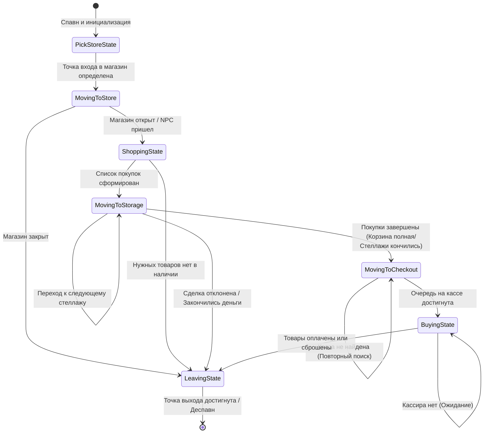

## Иерархическая конечно-автоматная система (FSM AI)

В проекте реализована классическая архитектура **Finite State Machine (State Pattern)** для управления поведением покупателей (NPC) в симуляторе магазина. Система полностью развязана (decoupled): контроллер `NPCController` выступает в роли контекста, а логика состояний инкапсулирована в отдельных классах, наследующих интерфейс `INPCState`.

### Граф состояний ИИ (State Transition Diagram)

